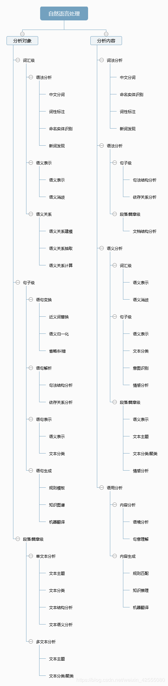

# AI基础知识
<!-- @author DHJT 2019-01-18 -->

问答 Question Answering (SQuAD v1.1)，推理 Natural Language Inference (MNLI) 

## NLP(自然语言处理)
NLP (Natural Language Processing) 是人工智能（AI）的一个子领域。

### 主要范畴
- 文本朗读（Text to speech）/语音合成（Speech synthesis）
- 语音识别（Speech recognition）
- 中文自动分词（Chinese word segmentation）
- 词性标注（Part-of-speech tagging）
- 句法分析（Parsing）
- 自然语言生成（Natural language generation）
- 文本分类（Text categorization）
- 信息检索（Information retrieval）
- 信息抽取（Information extraction）
- 文字校对（Text-proofing）
- 问答系统（Question answering）
- 机器翻译（Machine translation）
- 自动摘要（Automatic summarization）
- 文字蕴涵（Textual entailment）

### BERT
BERT 可以用于问答系统，情感分析，垃圾邮件过滤，命名实体识别，文档聚类等任务中，作为这些任务的基础设施即语言模型，
https://github.com/google-research/bert

## ANN(Artificial Neural Network，人工神经网络)
人工神经网络模型主要考虑网络连接的拓扑结构、神经元的特征、学习规则等。目前，已有近40种神经网络模型，其中有反传网络、感知器、自组织映射、Hopfield网络、波耳兹曼机、适应谐振理论等。根据连接的拓扑结构，神经网络模型可以分为：
前向网络，反馈网络；

### RNN（循环神经网络）

### 深度前馈网络（deep feedforward network），也叫作前馈神经网络（feedforward neural network）或者多层感知机（multilayer perceptron，MLP）

## X-Deep Learning
面向高维稀疏数据场景的深度优化工具 `X-Deep Learning`

大规模分布式图表征学习框架 Euler[^1]
- 大规模图的分布式学习
- 支持复杂异构图的表征
- 图学习与深度学习的结合
- 分层抽象与灵活扩展

[^1]: https://github.com/alibaba/euler 'test'
[^2]: https://github.com/alibaba/euler 'test'