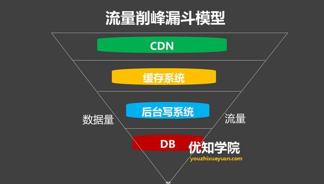

# 高并发架构
<!-- @author DHJT 2020-06-05 -->

流量削峰？如何解决秒杀业务的削峰场景

双11秒杀，短时间上亿的用户涌入，瞬间流量巨大（高并发），比如：200万人准备在凌晨12:00准备抢购一件商品，但是商品的数量缺是有限的100-500件左右。

1.消息队列解决削峰
用消息队列来缓冲瞬时流量，把同步的直接调用转换成异步的间接推送，中间通过一个队列在一端承接瞬时的流量洪峰，在另一端平滑地将消息推送出去。

消息队列中间件主要解决应用耦合，异步消息， 流量削锋等问题。常用消息队列系统：目前在生产环境，使用较多的消息队列有 ActiveMQ、RabbitMQ、 ZeroMQ、Kafka、MetaMQ、RocketMQ 等。
2.流量削峰漏斗：层层削峰
对请求进行分层过滤，从而过滤掉一些无效的请求。

分层过滤其实就是采用“漏斗”式设计来处理请求的，如下图所示：

1）分层过滤的核心思想

通过在不同的层次尽可能地过滤掉无效请求。

通过CDN过滤掉大量的图片，静态资源的请求。

再通过类似Redis这样的分布式缓存，过滤请求等就是典型的在上游拦截读请求。

2）分层过滤的基本原则

对写数据进行基于时间的合理分片，过滤掉过期的失效请求。

对写请求做限流保护，将超出系统承载能力的请求过滤掉。

涉及到的读数据不做强一致性校验，减少因为一致性校验产生瓶颈的问题。

对写数据进行强一致性校验，只保留最后有效的数据。

最终，让“漏斗”最末端(数据库)的才是有效请求。例如：当用户真实达到订单和支付的流程，这个是需要数据强一致性的。
