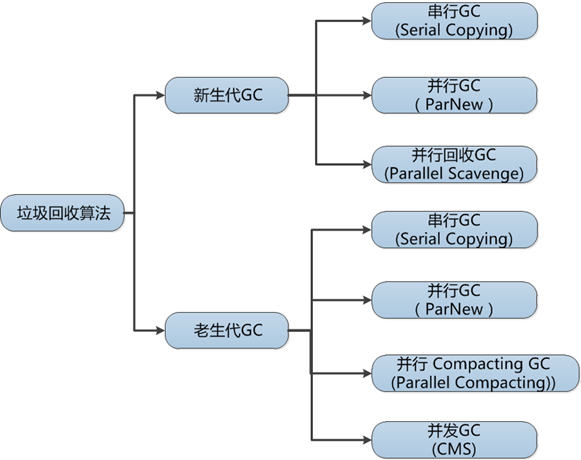

# JVM原理
<!-- @autho DHJT 2019-02-14 -->
目前有三大Java虚拟机：HotSpot，oracle JRockit，IBM J9。

### 自定义类加载器
- [为什么要类加载器，类加载器做了什么,加载类的过程][1]
类加载器:启动类加载器(bootstrap classLoader),扩展类加载器(extension),应用类加载器(Application),自定义类加载器(user ClassLoader);
双亲委派模型:如果一个类加载器收到了加载某个类的请求,则该类加载器并不会去加载该类,而是把这个请求委派给父类加载器,每一个层次的类加载器都是如此,因此所有的类加载请求最终都会传送到顶端的启动类加载器;只有当父类加载器在其搜索范围内无法找到所需的类,并将该结果反馈给子类加载器,子类加载器会尝试去自己加载.

使用双亲委派模型原因:java类随着其类加载器一起具备了一种带有优先级的层次关系.例如 java.lang.Object,无论哪一个类加载器要加载该类,最终都是委托给处于顶端的启动类加载器,因此object在程序的各种类加载器环境中都是同一个类.相反如果没有使用双亲委派模型,那么假如用户自定义了一个称为java.lang.Object的类,并放在classPath中,那么系统将会出现多个不同的Object类,则java类型体系中最基础的行为都无法保证.

为什么需要自定义类加载器:
- 我们需要的类不一定存放在已经设置好的classPath下(有系统类加载器AppClassLoader加载的路径)，对于自定义路径中的class类文件的加载，我们需要自己的ClassLoader.
- 加密:java代码可以轻易的被反编译,如果你需要对你的代码进行加密以防止反编译,可以先将编译后的代码用加密算法加密,类加密后就不能再使用java自带的类加载器了,这时候就需要自定义类加载器.
- 从非标准的来源加载代码:字节码是放在数据库,甚至是云端,就可以自定义类加载器,从指定来源加载类.
- 可以定义类的实现机制，实现类的热部署,如OSGi中的bundle模块就是通过实现自己的ClassLoader实现的。

自定义类加载器的方法:
1、如果不想打破双亲委派模型，那么只需要重写findClass方法即可.
2、如果想打破双亲委派模型，那么就重写整个loadClass方法
创建自己的ClassLoader时只需要覆写findClass(name)和findResource()即可
```java
    private File getClassFile(String name) {
        File file = new File("D:/Person.class");// 此处要提前编译Person类,并把class文件放到d盘下.
        return file;
    }
```

## 基础

### 垃圾回收器类型
1、串行：垃圾回收器 (Serial Garbage Collector)
2、串行：ParNew收集器
3、并行：Parallel收集器
4、并行：Parallel Old 收集器
5、并发标记扫描CMS收集器
CMS（Concurrent Mark Sweep）
6、G1收集器

#### 垃圾回收现象，minor GC、major GC和full GC。

### Class热替换与卸载
运行的时候配置VM参数: `-verbose:class`；用于查看class的加载与卸载情况。 输出结果
```sh
[Loaded java.net.URI$Parser from E:\java\jdk1.7.0_03\jre\lib\rt.jar] [Loaded testjvm.testclassloader.A from file:/E:/IDE/work_place/ZJob-Note/bin/] [Unloading class testjvm.testclassloader.A] GC over [Loaded sun.misc.Cleaner from E:\java\jdk1.7.0_03\jre\lib\rt.jar] [Loaded java.lang.Shutdown from E:\java\jdk1.7.0_03\jre\lib\rt.jar]
```
(1) 启动类加载器加载的类型在整个运行期间是不可能被卸载的(jvm和jls规范).
(2) 被系统类加载器和标准扩展类加载器加载的类型在运行期间不太可能被卸载，因为系统类加载器实例或者标准扩展类的实例基本上在整个运行期间总能直接或者间接的访问的到，其达到unreachable的可能性极小.(当然，在虚拟机快退出的时候可以，因为不管ClassLoader实例或者Class(java.lang.Class)实例也都是在堆中存在，同样遵循垃圾收集的规则).
(3) 被开发者自定义的类加载器实例加载的类型只有在很简单的上下文环境中才能被卸载，而且一般还要借助于强制调用虚拟机的垃圾收集功能才可以做到.可以预想，稍微复杂点的应用场景中(尤其很多时候，用户在开发自定义类加载器实例的时候采用缓存的策略以提高系统性能)，被加载的类型在运行期间也是几乎不太可能被卸载的(至少卸载的时间是不确定的).

综合以上三点， 一个已经加载的类型被卸载的几率很小至少被卸载的时间是不确定的.可以看的出来，在开发代码时候，不应该对虚拟机的类型卸载做任何假设的前提下来实现系统中的特定功能.

### 对象池（object pool）
在Java 5.0之前，分配对象的代价很大，以至于大家都使用内存池。但是从5.0开始，对象分配和垃圾回收变得快多了，研发人员发现了性能的提升，纷纷简化他们的代码，不再使用内存池，而直接用new来分配对象。从5.0开始，只有一些分配代价较大的对象，比如线程、套接字和数据库链接，用内存池才会有明显的性能提升。
主要用于两类对象。第一类是生命周期较短，且结构简单的对象，在内存池中重复利用这些对象能增加CPU缓存的命中率，从而提高性能。第二种情况是加载含有大量重复对象的大片数据，此时使用内存池能减少垃圾回收的时间。

### 堆外内存（off-heap memory）
1. 对于大内存有良好的伸缩性
2. 对垃圾回收停顿的改善可以明显感觉到
3. 在进程间可以共享，减少虚拟机间的复制
4. Lawery还提到对外内存最重要的还不是它能改进性能，而是它的确定性。
在堆内内存中存放的buffer对象实例被垃圾回收算法回收掉的时候，这个buffer对应的堆外内存区域同时也就被释放掉了。
- 优点 ：
    + 可以很方便的自主开辟很大的内存空间，对大内存的伸缩性很好
    + 减少垃圾回收带来的系统停顿时间
    + 直接受操作系统控制，可以直接被其他进程和设备访问，减少了原本从虚拟机复制的过程
    + 特别适合那些分配次数少，读写操作很频繁的场景
- 缺点 ：
    + 容易出现内存泄漏，并且很难排查
    + 堆外内存的数据结构不直观，当存储结构复杂的对象时，会浪费大量的时间对其进行串行化。
```java
// java 在NIO 包中提供了ByteBuffer类，对堆外内存进行访问。
// 直接开辟指定大小的堆外内存：
ByteBuffer buffer = ByteBuffer.allocateDirect(10 * 1024 * 1024);
```

### 方法区
在Java虚拟机中，方法区是可供各线程共享的运行时内存区域。
在不同的JDK版本中，方法区中存储的数据是不一样的。
在JDK1.6及之前，运行时常量池是方法区的一个部分，同时方法区里面存储了类的元数据信息、静态变量、即时编译器编译后的代码（比如spring 使用IOC或者AOP创建bean时，或者使用cglib，反射的形式动态生成class信息等）等。
在JDK1.7及以后，JVM已经将运行时常量池从方法区中移了出来，在JVM堆开辟了一块区域存放常量池。

- JDK1.8以前的HotSpot JVM有方法区，也叫永久代(permanent generation)。
- 方法区用于存放已被虚拟机加载的类信息、常量、静态变量，即编译器编译后的代码。
- 方法区是一片连续的堆空间，通过`-XX:MaxPermSize`来设定永久代最大可分配空间，当JVM加载的类信息容量超过了这个值，会报`OOM:PermGen`错误。
- 永久代的GC是和老年代(old generation)捆绑在一起的，无论谁满了，都会触发永久代和老年代的垃圾收集。
- JDK1.7开始了方法区的部分移除：符号引用(Symbols)移至native heap，字面量(interned strings)和静态变量(class statics)移至java heap。

#### 方法区和永久代的关系
在Java虚拟机规范中，方法区在虚拟机启动的时候创建，虽然方法区是堆的逻辑组成部分，但是简单的虚拟机实现可以选择不在方法区实现垃圾回收与压缩。这个版本的虚拟机规范也不限定实现方法区的内存位置和编译代码的管理策略。所以不同的JVM厂商，针对自己的JVM可能有不同的方法区实现方式。

在HotSpot中，设计者将方法区纳入GC分代收集。HotSpot虚拟机堆内存被分为新生代和老年代，对堆内存进行分代管理，所以HotSpot虚拟机使用者更愿意将方法区称为老年代。

方法区和永久代的关系很像Java中接口和类的关系，类实现了接口，而永久代就是HotSpot虚拟机对虚拟机规范中方法区的一种实现方式。

### 元空间(Metaspace)
HotSpot虚拟机在1.8之后已经取消了永久代，改为元空间，类的元信息被存储在元空间中。元空间没有使用堆内存，而是与堆不相连的本地内存区域。所以，理论上系统可以使用的内存有多大，元空间就有多大，所以不会出现永久代存在时的内存溢出问题。

## 高级

### 调优
- JVM Server与Client运行模式
- -Server模式启动时，速度较慢，但是一旦运行起来后，性能将会有很大的提升.原因是:
当虚拟机运行在-client模式的时候,使用的是一个代号为C1的轻量级编译器, 而-server模式启动的虚拟机采用相对重量级,代号为C2的编译器. C2比C1编译器编译的相对彻底,,服务起来之后,性能更高.
`JAVA_HOME/jre/lib/amd64/jvm.cfg`/`JAVA_HOME/jre/lib/i386/jvm.cfg`




[1]: https://blog.csdn.net/xiaoliuliu2050/article/details/53023734 '为什么要类加载器，类加载器做了什么,加载类的过程'
[2]: https://mp.weixin.qq.com/s/3_DEPdZTnGmdGBd5iTrVjQ 'JVM核心知识体系'
[3]: https://blog.csdn.net/coderlius/article/details/79272773 '详解 JVM Garbage First(G1) 垃圾收集器'
[4]: https://blog.csdn.net/high2011/article/details/80177473 '[Java基础]-- Java GC 垃圾回收器的分类和优缺点'