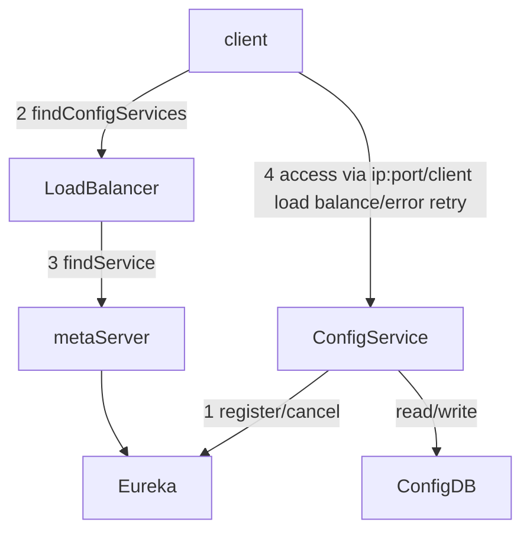

# Markdown语法
<!-- @author DHJT 2019-01-17 -->

流程图、序列图、甘特图、Todo 列表等语法[^1]

:blush:




``` mermaid
graph TB %% tab completion: 'graph'
  ID-1[Node 1] %% tab completion: 'node'
  ID-2>Node 2]
  ID-3(Node 3)
  ID-1---ID-2 %% tab completion: 'link'
  ID-1 --> ID-3
  ID-2--Link between 2 and 3---ID-3
  ID-3-->|Action from 3 to 1|ID-1
  ID-3 -- "Action from 3 to 2. p/w: '_-!#$%^&*+=?,\'" --> ID-2
  %% tab completion: 'class'
  classDef blue fill:#08f,stroke:#008
  class ID-1 blue
  %% tab completion: 'click'
  click ID-1 "https://github.com" "Tooltip text"
  click ID-2 alert "Tooltip for a callback"
  subgraph A subgraph
    ID-4{Node 4}
    ID-5((fa:fa-spinner))
    ID-6["Node 6 (same #quot;shape#quot;)"]
    ID-4-.->ID-5
    ID-5 -. Action from 5 to 4 .-> ID-4
    ID-5==>ID-6
    ID-6 == Action from 6 to 5 ==> ID-5
  end %% tab completion: 'subgraph'
```


``` sequence
title: 时序图例子
A->B: 实线实箭头
B-->C: 虚线实箭头
C->>C: 实线虚箭头
note right of C: 自通知
note over B,C:横跨通知
C->A:长通知
note left of A:左通知
```
``` flow
start=>start: 开始
isLogin=>condition: 是否登录
login=>operation: 登录
view=>operation: 浏览
end=>end: 结束

start->isLogin
isLogin(no)->login->view
isLogin(yes)->view
view->end
```

```gantt
        dateFormat  YYYY-MM-DD
        title Adding GANTT diagram functionality to mermaid
        section A section
        Completed task            :done,    des1, 2014-01-06,2014-01-08
        Active task               :active,  des2, 2014-01-09, 3d
        Future task               :         des3, after des2, 5d
        Future task2               :         des4, after des3, 5d
        section Critical tasks
        Completed task in the critical line :crit, done, 2014-01-06,24h
        Implement parser and jison          :crit, done, after des1, 2d
        Create tests for parser             :crit, active, 3d
        Future task in critical line        :crit, 5d
        Create tests for renderer           :2d
        Add to mermaid                      :1d
```


[^1]: [小专栏 Markdown 增加流程图、序列图、甘特图、Todo 列表等语法](https://xiaozhuanlan.com/topic/3758460291)
[^2]: [Markdown的简单上手教程](https://www.jianshu.com/p/8c7812fd80b3)
[^3]: [\[MarkDown\] markdown语法小结](https://www.cnblogs.com/rossoneri/p/4446440.html)
[^4]: [【简明版】有道云笔记Markdown指南](http://note.youdao.com/iyoudao/?p=2411)