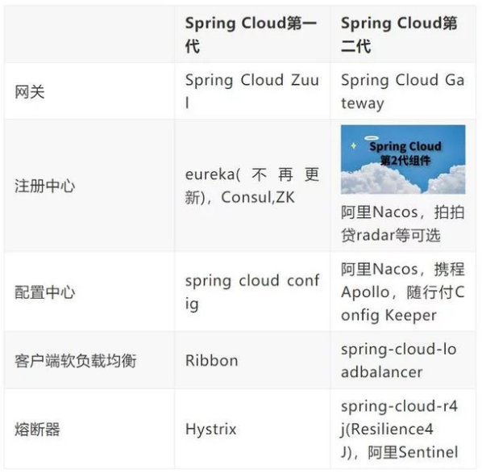

# SpringCloud
<!-- @author DHJT 2018-12-17  -->
springCloud是基于SpringBoot的一整套实现微服务的框架。他提供了微服务开发所需的配置管理、服务发现、断路器、智能路由、微代理、控制总线、全局锁、决策竞选、分布式会话和集群状态管理等组件。最重要的是，跟spring boot框架一起使用的话，会让你开发微服务架构的云服务非常好的方便。

https://spring.io/projects/spring-cloud

Note
    The release train contains a `spring-cloud-dependencies` as well as the `spring-cloud-starter-parent`. You can use the parent as you would the `spring-boot-starter-parent` (if you are using Maven). If you only need dependency management, the "dependencies" version is a BOM-only version of the same thing (it just contains dependency management and no plugin declarations or direct references to Spring or Spring Boot). If you are using the Spring Boot parent POM, then you can use the BOM from Spring Cloud. The opposite is not true: using the Cloud parent makes it impossible, or at least unreliable, to also use the Boot BOM to change the version of Spring Boot and its dependencies. 
### Ribbon
@LoadBalanced
LB(Load Balance)
Spring Cloud Ribbon是基于Netflix Ribbon的实现的一套客户端 负载均衡的工具。
主要功能是提供客户端的软件负载均衡算法。

#### Ribbon核心组件IRule
- RoundRobinRule轮询

### Feign
集成了Ribbon。
是一个声明式的webservice客户端。
可以与Eureka和Ribbon组合使用以支持负载均衡。
声明式REST客户端：Feign

Eureka主要提供服务发现和注册，Ribbon提供负载均衡，Feign提供简单的服务调用。
### Hystrix
- 处理分布式系统中的延迟和容错。

#### 服务熔断
类似保险丝
- 避免级联故障。熔断机制：应对雪崩效应的一个微服务链路保护机制。@HystrixCommand

#### 服务降级
- 整体负荷考虑，整体资源快不够了，忍痛将某些服务先关掉，待渡过难关，再来开启回来。
- 服务降级是在客户端进行，与服务端无关。客户端自己准备本地的fallback回调，返回一个返回值。

#### 服务监控HystrixDashboard
- 7色、1圈、1线
- 故障实例和高压实例

### spring cloud子项目包括：
- `Spring Cloud Config`：配置管理开发工具包，可以让你把配置放到远程服务器，目前支持本地存储、Git以及Subversion。
- `Spring Cloud Bus`：事件、消息总线，用于在集群（例如，配置变化事件）中传播状态变化，可与Spring Cloud Config联合实现热部署。
- `Spring Cloud Netflix`：针对多种Netflix组件提供的开发工具包，其中包括Eureka、Hystrix、Zuul、Archaius等。
- `Netflix Eureka`：云端负载均衡，一个基于REST的服务，用于定位服务，以实现云端的负载均衡和中间层服务器的故障转移。
    + 保证AP。
- `Netflix Hystrix`：容错管理工具，旨在通过控制服务和第三方库的节点,从而对延迟和故障提供更强大的容错能力。
- `Netflix Zuul`：边缘服务工具，是提供动态路由，监控，弹性，安全等的边缘服务。
- `Netflix Archaius`：配置管理`API`，包含一系列配置管理`API`，提供动态类型化属性、线程安全配置操作、轮询框架、回调机制等功能。
- `Spring Cloud for Cloud Foundry`：通过`Oauth2`协议绑定服务到CloudFoundry，CloudFoundry是`VMware`推出的开源`PaaS`云平台。
- `Spring Cloud Sleuth`：日志收集工具包，封装了Dapper,Zipkin和HTrace操作。
- `Spring Cloud Data Flow`：大数据操作工具，通过命令行方式操作数据流。
- `Spring Cloud Security`：安全工具包，为你的应用程序添加安全控制，主要是指`OAuth2`。
- `Spring Cloud Consul`：封装了`Consul`操作，consul是一个服务发现与配置工具，与`Docker`容器可以无缝集成。
- `Spring Cloud Zookeeper`：操作`Zookeeper`的工具包，用于使用`zookeeper`方式的服务注册和发现。
- `Spring Cloud Stream`：数据流操作开发包，封装了与Redis,Rabbit、Kafka等发送接收消息。
- `Spring Cloud CLI`：基于`Spring Boot CLI`，可以让你以命令行方式快速建立云组件。

- SpringCloud特点
1：约定优于配置
2：开箱即用、快速启动
3：适用于各种环境
4：轻量级的组件
5：组件支持丰富，功能齐全

## 样例
- [spring cloud eureka-ribbon-fegin][1]
    + https://github.com/binary-vi/binary.github.io

[1]: https://www.cnblogs.com/vi-2525/p/8651470.html 'spring cloud eureka-ribbon-fegin'
[2]: https://blog.csdn.net/yongge1981/article/details/84060978 '（一）Spring Cloud实践： 使用Netflix Eureka实现服务注册与发现'
[3]: http://www.cnblogs.com/itmsbx/p/9692538.html '关于SpringCloud、SpringBoot 希望这是说得最详细的'
